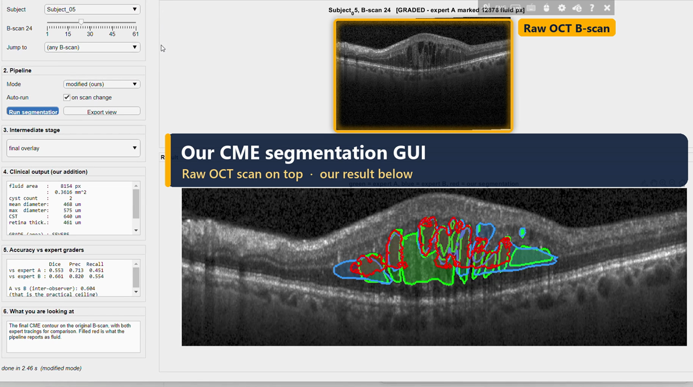

# Interpretable, Low-Resource CME Segmentation and Severity Grading from OCT B-Scans

**BME 404 — Medical Imaging Sessional · Section A2, Group 03**
Monon Mohammad Sadim Sami (2118027) · Nabil Faruque Rafin (2118029) · Suraiya Sujana Khan (2118041)

A fully classical, training-free MATLAB pipeline that segments cystoid macular
edema from OCT B-scans and converts the segmentation into a clinical severity
grade. No neural network, no training data, ~0.4 s per B-scan on a laptop.

---

## GUI demo video

[](media/gui_demo_explained.mp4)

A 1 min 44 s walkthrough of the MATLAB GUI with on-screen explanations:
picking a patient and B-scan, graded vs not-graded slices, switching the
pipeline mode, the clinical read-out, accuracy against both experts, and
exporting a figure. **[Watch / download the video](media/gui_demo_explained.mp4)**

---

## Quick start

**1. Get the code.** Download this repository (green *Code* button → *Download ZIP*)
or `git clone` it, then unzip anywhere.

**2. Get the data.** The Duke DME dataset is not included here, because its
licence allows research/educational use but not redistribution. Download it
from the dataset authors' page
(<http://people.duke.edu/~sf59/Chiu_BOE_2014_dataset.htm>) and copy
`Subject_01.mat` … `Subject_10.mat` into the `data/` folder of this repository.
Optional: run `addpath('src'); convertToV73` once to create faster-loading
copies in `data/v73/`; without it the original files are used.

**3. Run the GUI** (MATLAB R2021a or newer, Image Processing Toolbox):

```matlab
cd 'C:\path\to\BME404-CME-Segmentation'   % wherever you unzipped it
addpath('src','gui')

cmeGUI                      % launch the interactive demo GUI
```

To regenerate every number and figure in the report:

```matlab
addpath('scripts'); run_ALL     % ~25 minutes, regenerates everything
```

To segment a single B-scan from the command line:

```matlab
S   = loadBScan(5, 24);                 % subject 5, B-scan 24
res = segmentCME(S.img, cmeConfig('modified'));
imshow(vizOverlay(S.img, {S.fluid1, res.mask}, {[0 1 0],[1 0 0]}))
disp(res.clinical.grade)
```

---

## What this implements

**Reference papers** (both post-2015, as the course requires):

- Liu, Lou, Chen, Cai & Wang (2021), *Applied Sciences* 11(14):6480 — *Fast
  Segmentation Algorithm for Cystoid Macular Edema Based on Omnidirectional
  Wave Operator*. The base pipeline.
- Lou, Chen, Han, Liu, Wang & Cai (2020), *IEEE Access* 8:53678 — *Fast Retinal
  Segmentation Based on the Wave Algorithm*. Where the wave potential-energy
  equation, the Z/Q templates and the σ regulation factor come from.

**Dataset**: Duke SD-OCT DME set (Chiu et al. 2015), 10 subjects × 61 B-scans,
two independent expert fluid annotations. **Only 110 of the 610 B-scans were
ever graded** (11 per subject): 78 contain expert-A fluid and only **19** are
fluid-free according to *both* graders. On the other 500 `manualFluid1` is entirely NaN — those scans were
never examined, so nothing we output there can be called a false positive. The
GUI states which of the three cases each B-scan is in. Research/educational use only, no
redistribution — cite Chiu et al. Data lives in `data/` and is not part of this
repository's deliverable.

**Pipeline** (Fig. 1 of the 2021 paper):

| Stage | Baseline mode (the paper) | Modified mode (ours) |
|---|---|---|
| Denoise | Gaussian blur | **median filter** `medfilt2` |
| Contrast | gamma transform | **CLAHE** `adapthisteq`, 4×4 tiles |
| ROI | row-mean-gray → A/B, wave-refined ILM/OBM | same, plus an explicit inner-retina depth band |
| Operator | omnidirectional wave operator, θ = 0, π/2, π, 3π/2 | same |
| Threshold | fixed global α = meanB/meanT | **Otsu / Niblack** (Niblack implemented from scratch) |
| Region forming | close the arcs + `imfill` | **hysteresis on the low-energy basin**, fenced by the contours |
| Screening | mean-gray + 0.5–1.5× thickness | same rules, thickness window measured from the data |
| Output | contour only | **area / cyst count / diameter / CST → severity grade** |

Both modes run from the same code path — `cmeConfig('baseline')` vs
`cmeConfig('modified')` — so every comparison table is produced by running one
driver twice.

---

## Results

On all 78 fluid-positive B-scans, scored inside the graders' annotated window
and averaged over both expert graders:

| | scored against | Dice | Precision | Recall | s/scan |
|---|---|---|---|---|---|
| Liu et al. 2021 (as reported by the authors) | their graders | 0.811 | 0.888 | 0.750 | 1.2 |
| Our baseline re-implementation of that pipeline | A and B averaged | 0.025 | 0.026 | 0.029 | 0.33 |
| Our modified pipeline, tuned and tested on all 78 | A and B averaged | 0.445 | 0.414 | 0.580 | 0.40 |
| Our modified pipeline, tuned and tested on all 78 | expert A | 0.426 | 0.393 | 0.604 | 0.40 |
| **Our modified pipeline, leave-one-subject-out** | **expert A** | **0.411** | 0.394 | 0.581 | 0.40 |
| *Expert A vs Expert B (inter-observer ceiling)* | each other | *0.58* | — | — | — |

The leave-one-subject-out row is scored against expert A, so compare it with
the 0.426 row, not with the averaged 0.445.

**Quote the 0.411.** It is the leave-one-subject-out figure: for each subject
the parameters were re-tuned on the other nine and then scored on that subject,
so no B-scan is ever scored with parameters chosen using the same patient's
data. The gap to the tuned number is only **0.015 Dice**, and nine of the ten
folds independently picked the same parameters — the tuning is not fitting
noise.

Three things to read alongside that table:

- **The two graders only agree with each other at Dice 0.58**, so 0.411 is
  about 71% of the realistic ceiling, not 41% of a perfect score. Six of the 78
  B-scans have an inter-observer Dice of 0 — the experts disagree completely.
- **Performance scales with lesion size**: Dice 0.6–0.8 on the larger cyst
  clusters, near 0 where the grader marked only a few hundred pixels.
- **Eight further improvements were tried and all measured worse** — volumetric
  denoising, non-local means, a layer-aware ROI, bottom-hat and local-variance
  features, vessel-shadow compensation, an elongation screen, and
  marker-controlled watershed splitting. Each is still in the code as a
  switchable option with its numbers recorded in `docs/FINDINGS.md` §7d.

The baseline scoring 0.025 is a real finding, not a broken re-implementation.
**Read `docs/FINDINGS.md` before quoting any of these numbers** — it gives the
two measured reasons (local edge SNR below 1 on this data; the paper's cyst-size
filter excludes 89% of the real cysts) with the evidence for each.

---

## Layout

```
src/                 all algorithm code -- the GUI and the scripts both call this
  cmeConfig.m          every tunable parameter, with [PAPER]/[OURS]/[LIT] provenance
  loadBScan.m          one B-scan + both expert masks + the graded window
  buildEvalSet.m       indexes all 610 B-scans, caches the result
  preprocessOCT.m      stage 1: denoise + contrast
  extractROI.m         stage 2: row-mean-gray, ILM/OBM, inner band
  waveMaps.m           the wave potential-energy and correction equations
  omniWaveContours.m   the direction-adjustment function, 4 directions
  integrateContours.m  stage 4: fusion + screening ('fill' and 'basin')
  niblackThreshold.m   Niblack local threshold, implemented from scratch
  clinicalQuantify.m   stage 5: area / count / diameter / CST
  gradeSeverity.m      severity mapping, with the cut-offs justified inline
  evalSegmentation.m   Dice / precision / recall / F1 / accuracy
  runBatch.m           batch driver + the paper's Table 1 layout
  directionalEnclosure.m, vizOverlay.m, figStyle.m, dukePaths.m

scripts/             run_00 … run_99, plus run_ALL.m; dev_*.m are the
                     measurement scripts behind docs/FINDINGS.md
gui/                 CMEApp.m (the app), cmeGUI.m (launcher)
results/figures/     every figure + MANIFEST.csv describing each one
results/tables/      every numeric result as CSV
docs/FINDINGS.md     the measurements that drove the design decisions
docs/BUILTINS.md     every MATLAB built-in used, what it computes, why
docs/VIVA_NOTES.md   likely questions and the honest answers
docs/PROJECT_REPORT.md       short written report of the whole project
docs/FINDINGS_volumetric.md  neighbour-slice (3-D) test: tested, not adopted
                     (src/segmentCME3D.m, scripts/run_11_volumetric.m)
data/                Subject_01.mat … Subject_10.mat
data/v73/            the same files converted to MAT v7.3 (much faster to read;
                     created once by convertToV73, used automatically)
```

---

## Notes for the viva

- Every non-obvious built-in (`medfilt2`, `adapthisteq`, `graythresh`,
  `imfill`, `imclose`, `imreconstruct`, `imhmin`, `bwlabel`, `regionprops`,
  `imrotate`, `movmedian`) carries a comment explaining *what it does
  internally* and *why it is the right tool there*, not just that it is called.
- Niblack is implemented by hand (`niblackThreshold.m`) because MATLAB has no
  built-in Niblack — `imbinarize(...,'adaptive')` is Bradley's method, a
  different formula.
- Nothing in the pipeline is trained or learned.
- The GUI is a programmatic `uifigure` class rather than a binary `.mlapp`, so
  the entire interface is readable source code. It contains no algorithm logic;
  it calls the same `src/` functions the batch scripts use.
- `docs/FINDINGS.md` §6 explains two inconsistencies in the reference paper
  (its "accuracy" is precision; its Dice and F1 are the same quantity).
